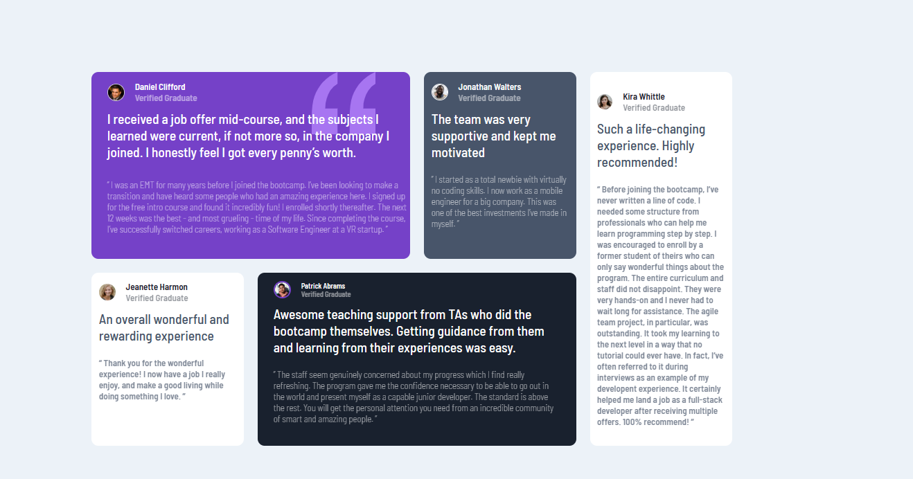

# FM-Testimonials-Grid-Section-Main
Frontend Mentor | Testimonials Grid Section Main

# Frontend Mentor - Testimonials grid section solution

This is a solution to the [Testimonials grid section challenge on Frontend Mentor](https://www.frontendmentor.io/challenges/testimonials-grid-section-Nnw6J7Un7). Frontend Mentor challenges help you improve your coding skills by building realistic projects. 

## Table of contents

- [Overview](#overview)
  - [The challenge](#the-challenge)
  - [Screenshot](#screenshot)
  - [Links](#links)
- [My process](#my-process)
  - [Built with](#built-with)
  - [What I learned](#what-i-learned)
  - [Continued development](#continued-development)
- [Author](#author)

## Overview

### The challenge

Users should be able to:

- View the optimal layout for the site depending on their device's screen size

### Screenshot

<figure>
  
</figure>
### Links

- Solution URL: [GItHub](https://github.com/abdellah-abadou/FM-Testimonials-Grid-Section-Main)
- Live Site URL: [preview](https://fm-testimonials-grid-section-main.netlify.app/)

## My process

I worked on this project for about two and a half hours. In fact, there are some points that I did not work on because I wanted to finish the project quickly. The code works, but it is not the best.

### Built with

- Semantic HTML5 markup
- CSS custom properties
- Flexbox
- CSS Grid

### What I learned

I learn  CSS grid

### Continued development

I want to improve the way I write my code to become cleaner, and learn more about CSS properties

## Author

- Frontend Mentor - [@abdellah-abadou](https://www.frontendmentor.io/profile/abdellah-abadou)
